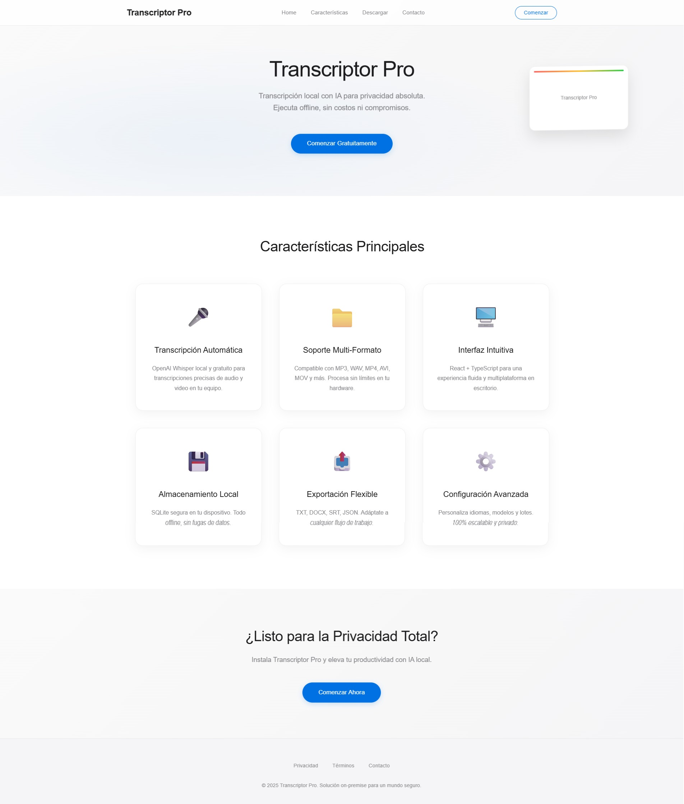
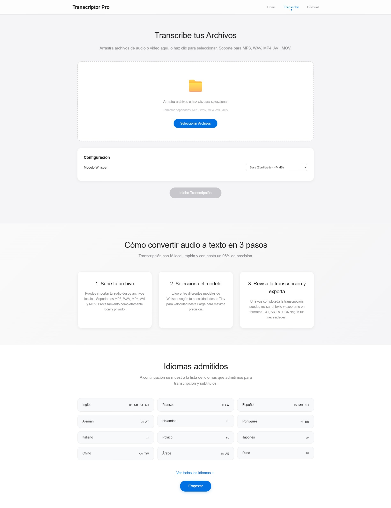
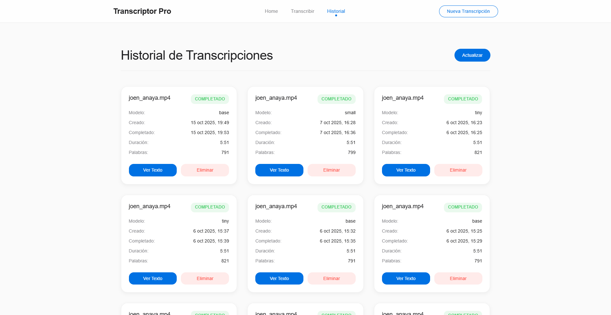
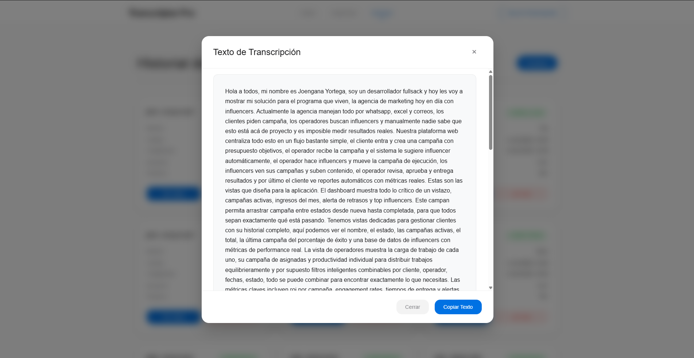

# Transcriptor Pro

A desktop application for local audio/video transcription using AI. Built with Electron, React, and Express.js, ensuring complete data privacy by running entirely offline.

## Application Views

### Home Page

The main landing page showcases the application features and provides easy navigation to transcription and history sections.

### Transcription Upload

The upload interface allows you to drag and drop audio/video files, select Whisper models, and monitor transcription progress in real-time.

### History & Management

View all your completed transcriptions with detailed metadata including file names, creation dates, models used, and processing status.

### Transcription Details

View and copy the complete transcription text in a dedicated modal window with easy text selection and copying capabilities.

## Features

- **Local Processing**: All transcription happens on your device - no data leaves your computer
- **Multiple Formats**: Support for various audio and video file formats
- **AI-Powered**: Uses Whisper AI for high-quality transcription
- **Cross-Platform**: Works on Windows, macOS, and Linux
- **Progress Tracking**: Real-time transcription progress with status updates
- **History Management**: View and manage all your transcriptions in one place

## Architecture

Transcriptor Pro uses a multi-process Electron architecture:

- **Main Process**: Handles app lifecycle and runs an embedded Express.js server
- **Renderer Process**: React-based user interface
- **Backend API**: REST endpoints for transcription management
- **Database**: SQLite with Prisma ORM for local data storage

## Prerequisites

- Node.js (v16 or higher)
- npm or yarn
- Python (for Whisper AI integration)

## Installation

1. Clone the repository:
```bash
git clone <repository-url>
cd Transcriptor-app
```

2. Install dependencies:
```bash
npm install
```

3. Set up the database:
```bash
npx prisma generate
npx prisma migrate dev
```

## Development

### Start Development Server
```bash
npm run dev
```
This starts both the React development server (port 3000) and the Electron app with hot reload.

### Build Commands
```bash
npm run build          # Build both main and renderer
npm run build:main     # Build main process only
npm run build:renderer # Build renderer process only
npm run build:preload  # Build preload script
```

### Database Management
```bash
npm run prisma:studio    # Launch Prisma Studio database viewer
npx prisma generate     # Regenerate Prisma client
npx prisma migrate dev  # Create and apply new migration
```

### Code Quality
```bash
npm run lint        # Run ESLint
npm run lint:fix   # Fix ESLint issues
npm run format     # Format with Prettier
```

## Production

### Package Application
```bash
npm run pack    # Package app (no installer)
npm run dist    # Build distributables for current platform
```

### Run Built Application
```bash
npm start
```

## Usage

1. **Launch the Application**: Start Transcriptor Pro from your applications folder or run `npm start`

2. **Upload Audio/Video**: Click the upload area or drag and drop your audio/video files

3. **Monitor Progress**: Watch real-time transcription progress in the interface

4. **View Results**: Access your completed transcriptions in the history section

5. **Export Data**: Copy or export your transcription results as needed

## API Endpoints

The embedded Express server provides these endpoints:

- `GET /api/health` - Health check
- `GET /api/transcription/list` - List all transcriptions
- `POST /api/transcription/upload` - Upload file for transcription

## Project Structure

```
src/
├── main/           # Electron main process
│   ├── ipc/        # IPC handlers
│   ├── server/     # Express.js server
│   ├── services/   # Business logic
│   └── utils/      # Utilities
├── renderer/       # React frontend
│   ├── components/ # React components
│   ├── pages/      # Page components
│   └── styles/     # CSS styles
├── shared/         # Shared utilities
└── types/          # TypeScript definitions
```

## Database Schema

The application uses SQLite with the following main entity:

- **Transcription**: Stores file metadata, processing status, progress, and results

## Technologies Used

- **Electron**: Desktop app framework
- **React**: Frontend framework
- **Express.js**: Backend server
- **SQLite**: Local database
- **Prisma**: Database ORM
- **TypeScript**: Type safety
- **Webpack**: Module bundling
- **Whisper AI**: Transcription engine

## Contributing

1. Fork the repository
2. Create a feature branch: `git checkout -b feature-name`
3. Make your changes
4. Run tests and linting: `npm run lint`
5. Commit your changes: `git commit -m 'Add feature'`
6. Push to the branch: `git push origin feature-name`
7. Submit a pull request

## Privacy & Security

- **100% Local**: No data is sent to external servers
- **Offline Processing**: Works completely offline
- **Temporary Storage**: Files are only temporarily stored during processing
- **Local Database**: All data remains on your device

## Support

For issues, feature requests, or questions:
1. Check existing issues in the repository
2. Create a new issue with detailed information
3. Include system information and steps to reproduce

## License

[Add your license information here]

## Roadmap

- [ ] Multiple transcription model support
- [ ] Batch processing
- [ ] Advanced export formats
- [ ] Real-time transcription
- [ ] Speaker identification
- [ ] Custom model training

---

Built with ❤️ for privacy-conscious users who need reliable, local transcription capabilities.